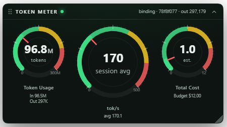

# dsh-token-gauge

A live token meter for the [DeepSeek Harness](https://github.com/deepseek-ai/deepseek-harness) Web GUI: three instrument dials, floating over the app, draggable anywhere, remembering where you put them.

<p align="center">
  
</p>

## What it shows

| Dial | Scale | What the reading means |
|---|---|---|
| **Token Usage** (left) | 0 – 300M | Cumulative tokens across the whole session log. The needle climbing into the amber band means the model is reading far more context than it is producing — usually a sign the session has grown past what the model handles well. |
| **tok/s** (centre, largest) | 0 – 500 | Decode throughput, measured from the page's own observation (output tokens gained per second) and falling back to the session's recorded average while idle. Erratic readings are the tell for an unstable backend. |
| **Total Cost** (right) | 0 – $12 | Estimated spend against a budget, from reference token pricing. |

Each dial carries a real scale with green / amber / red warning bands, a needle, the figure in large type inside the dial, and the fine detail (`In` / `Out` split, session average, budget) printed underneath — the way a car's cluster reads at a glance.

Every figure comes from session projections the Web client already receives (`tokenUsage`, `contextPressure`, `contextBreakdown`, `sessionStats`). The plugin adds **no session events, no tools, and no model-visible content**: it is a read-only view, so it cannot affect a conversation.

## Requirements

- DSH running the `web` profile (`dsh web` or `npx @deepseek-ai/dsh web`).
- DSH **0.1.5-rc.2** is what this is developed and tested against. The plugin consumes `ctx.sessions`, `ctx.slots`, and four projection keys; a DSH release that renames any of those needs a matching update here.

## Install

```sh
# The profile's own plugin manager (needs pnpm on PATH):
dsh plugin --profile web add @stone100010/dsh-token-gauge
```

If pnpm is unavailable, or `dsh` itself is not on your PATH — common when DSH is launched through `npx`, whose bin directory never reaches an interactive shell — use the bundled helpers, which locate `dsh` themselves and perform the same link-and-register work by hand:

```sh
git clone https://github.com/stone100010/dsh-token-gauge.git
cd dsh-token-gauge
./setup.sh install      # symlink into ~/.dsh/profiles/web + register the bundle row
./setup.sh verify       # compose the profile tree and confirm the plugin resolves
./restart-and-verify.sh # restart dsh web, capture the startup token, confirm it loaded
```

Installed from npm instead? `setup.sh` ships in the tarball, but run it from a clone if you also want `restart-and-verify.sh` — npm installs only the runtime files.

Either way, open the tokenized URL the server prints and **hard refresh** (`Ctrl+Shift+R`) once: client bundles load at page load.

The panel appears in the bottom-right. Drag its header to move it, drag the bottom-right corner to resize, and use the header control to collapse it. Position, size, and collapsed state persist per browser.

## How it mounts

The panel registers into `shell.overlay` — the frame-wide, click-through `list` seat declared by `@deepseek-ai/dsh-client-ui-layout`. Contributing there is additive (a new `id` beside the shipped entries) and the layer is click-through, so the panel never blocks the app underneath.

```
T0  panel root                                       .td-root
├─ A   header (drag handle)                          .td-header
│  ├─ A1 grip · A2 title · A3 feed indicator · A4 route+session readout · A5 collapse
├─ B   dial cluster                                  .td-gauges
│  ├─ B1 Token Usage (small)
│  ├─ B2 tok/s (large)
│  └─ B3 Total Cost (small)
├─ D   empty state (only while no projection has arrived)
└─ E   resize corner                                 .td-resize
```

`A4` is the diagnostic line: it names the resolution route (`binding`, `scope`, or `unresolved`), the session id being read, and the current output-token count. When a figure looks wrong, that line says which session it came from.

## Configuration

Scales and reference prices are constants at the top of `lib/client.js`:

```js
const SCALE_TOKENS = 300e6;   // left dial maximum
const SCALE_RATE   = 500;     // centre dial maximum
const SCALE_COST   = 12;      // right dial maximum, also the budget
const ZONES = { tokens: [0.5, 0.8], rate: [0.6, 0.84], cost: [0.5, 0.8] }; // amber, red
const PRICES = { uncachedInput: 0.14, cacheRead: 0.0028, cacheWrite: 0.14, output: 0.28 }; // USD / M
```

**The cost dial is an estimate.** `deepseek-v4.1-flash` is absent from DSH's installed model catalog, so DSH computes no cost for it and there is no cost projection to read; the defaults mirror the catalog's `deepseek` family entry. Put your gateway's real per-million rates in `PRICES` — at a $12 scale, pricing accuracy is what makes the dial trustworthy. The dial is labelled `est.` for exactly this reason.

## Development

`lib/client.js` is a **hand-authored ModuleLoader bundle**, not a build artifact: it keeps the exact shell DSH's client loader expects and resolves its externals with `require()` at load time. There is no build step and nothing to install.

```sh
node test/harness.mjs        # 61 checks
```

The harness executes the real bundle against faithful stand-ins — the ModuleLoader facade, a React hook dispatcher with `Object.is` dependency comparison, `ctx.slots`, and `ctx.sessions` — covering registration, projection subscription, wire-shape normalisation, session switching, route fallbacks and retries, dragging, resizing, clamping, persistence, and disposal.

Two rules the tests encode, learned the hard way:

- **Fixtures must use the wire shape.** Projections are published through a `wire.view` transform, and `tokenUsage` flattens to its four buckets (`view: state => state.totals`). A fixture that used the host-side nested shape once let a zero-figures bug ship.
- **A broken route must not look live.** Reading a face through `useSyncExternalStore` keeps the last snapshot across a re-subscribe, so the panel gates on the resolved face and reports `unresolved` rather than showing frozen numbers.

Renaming the package touches the manifest, the bundle id, the loader row, the storage prefix, and the test expectations. Use the tool rather than editing by hand — it rewrites all of them and fails if the result is inconsistent:

```sh
node tools/rename.mjs @you/dsh-token-gauge
```

## Uninstall

```sh
./setup.sh uninstall     # or: dsh plugin --profile web remove @stone100010/dsh-token-gauge
```

Restart `dsh web` afterwards.

## License

MIT — see [LICENSE](LICENSE).
